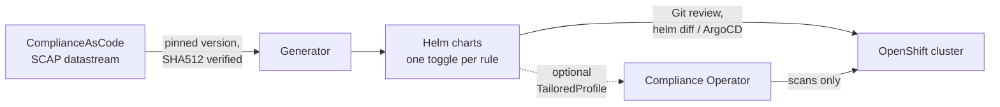

# openshift-compliance-remediations

[](https://github.com/slauger/openshift-compliance-remediations/actions/workflows/ci.yaml)
[](https://github.com/slauger/openshift-compliance-remediations/actions/workflows/release.yaml)
[](LICENSE)
[](https://github.com/slauger/openshift-compliance-remediations/blob/main/SECURITY.md)
[](https://docs.openshift.com/)

Generate Helm charts of OpenShift compliance **remediations** from the upstream [ComplianceAsCode/content](https://github.com/ComplianceAsCode/content) SCAP datastreams. This is the exact same content the OpenShift Compliance Operator materializes at runtime as `ComplianceRemediation` objects, extracted statically instead.

**New to this?** These charts harden your OpenShift cluster against established security benchmarks: CIS, BSI (German Federal Office for Information Security), DISA STIG, PCI-DSS, NIST 800-53 (moderate/high), NERC CIP and ACSC Essential Eight. You pick a profile, set it to `true` in `values.yaml`, and `helm install` applies the corresponding hardening: TLS policies, audit logging, encryption at rest, kubelet settings, OS-level controls and more, over 300 individually togglable rules. Every change is a plain Kubernetes manifest you can read, diff and version in Git *before* it touches the cluster; nothing is applied behind your back.

## Quick start

```bash
helm install compliance-platform oci://ghcr.io/slauger/charts/compliance-platform \
  --namespace openshift-compliance --create-namespace \
  --set profiles.ocp4-cis=true
```

Renders and applies all CIS platform remediations (safe, no reboots). Preview first with `helm template` or an ArgoCD diff. See [Install](#install) and [Generating from source](#generating-from-source) for details.

## Why

The Compliance Operator gives you two ways to apply remediations, and both have gaps:

- **Manual approval** (default): run a scan, wait for findings, then approve each `ComplianceRemediation` by hand. Reactive and slow; nothing is fixed until you've scanned and clicked through the results.
- **`autoApplyRemediations: true`**: the operator applies fixes automatically. Faster, but a **black box**. The actual manifests are materialized inside the cluster, so you can't review *what* changes before it happens, you have no Git history of your hardening posture, and a content update can silently alter applied objects.

Either way you don't own your hardening declaratively. This project extracts the very same remediations **statically** from the SCAP datastream into Helm charts, so instead you get:

- **Reviewable**: every fix is a plain manifest in Git; a `helm diff` / ArgoCD preview shows exactly what will change, per rule, before it hits the cluster.
- **Declarative & versioned**: your enabled profiles, per-rule overrides and variable values live in `values.yaml`; the applied posture is whatever Git says, full stop.
- **Explicit over implicit**: mutually-exclusive rules fail the render instead of silently merging; a content bump shows up as a concrete diff you approve, not a surprise re-apply.
- **Separation of duties**: the operator goes back to doing one thing well, **scanning**. Findings you decide to fix, you maintain in the chart (optionally re-scanned against a generated `TailoredProfile`).

## How it works



The generator downloads a pinned, checksum-verified content release, extracts every Kubernetes remediation, merges rules that target the same object, detects mutually-exclusive alternatives, and emits ready-to-install charts plus a full [rule matrix](RULES.md). A content update is a `config/content.yaml` bump whose effect shows up as a reviewable Git diff of the charts.

## Naming

Rules and profiles keep the **exact OpenShift/ComplianceAsCode naming** so results map 1:1:

- Profile: `<product>-<profile>`, e.g. `ocp4-cis`, `rhcos4-moderate`
- Rule id: `<product>-<rule_name_with_underscores>`, e.g. `ocp4-audit_profile_set`

## Charts

Two standalone charts plus a thin umbrella wrapper:

- `charts/compliance-platform/`: ocp4 platform config objects (APIServer, OAuth, IngressController, Project, Template, PrometheusRule). Safe, non-disruptive; no reboot.
- `charts/compliance-node/`: `MachineConfig` / `KubeletConfig` remediations (ocp4 node + all rhcos4). Gated behind `node.enabled=false` because applying them triggers **MachineConfigPool rollouts (node reboots)**. Emitted per node role.
- `charts/compliance-hardening/`: umbrella depending on both subcharts; values are prefixed per subchart (no `global`). Subcharts remain installable standalone.

## Conflicts and alternatives

Several rules target the **same** object (e.g. four rules edit `APIServer/cluster`). The generator merges disjoint contributions into one object, each rule individually togglable. Some rules are **mutually-exclusive alternatives**, e.g. two rules both write `spec.tlsSecurityProfile`. If more than one such rule is active, the chart **fails to render** with a clear message, forcing you to pick one. See [`RULES.md`](RULES.md) (rules marked ⚠️ alt).

## Applicability

Upstream rules carry XCCDF `<platform>` constraints. The Compliance Operator evaluates them at scan time and reports a rule that does not apply as `notapplicable`, generating no remediation for it. The charts mirror that: rather than shipping a remediation the operator would never produce, they **refuse to render** and name every offending rule at once.

Two constraints depend on facts only you can supply, so they are values:

```yaml
cluster:
  architecture: x86_64        # of the pools listed in node.roles
  hypershift: false
```

`make show-node-arch` reads the architecture off a live cluster. `amd64` and `arm64` are accepted and normalized, so `oc get nodes` output can be pasted straight in.

For a non-default architecture the generator ships a ready-made overlay listing exactly the rules that architecture cannot use:

```sh
helm install compliance ./charts/compliance-node -f charts/compliance-node/values-aarch64.yaml
```

On aarch64 that is 21 rules (audit rules for syscalls ARM64 does not have), on s390x 5. Without the overlay the render aborts and tells you which rules and why.

**Mixed-architecture clusters**: `cluster.architecture` describes the pools named in `node.roles`, and MachineConfigs target pools. Install the node chart once per architecture with the matching `node.roles` and `cluster.architecture` — object names are role-suffixed, so the releases do not collide. Leaving the default on a mixed cluster keeps today's behaviour (the operator reports the ARM nodes' rules as `notapplicable`); setting `aarch64` would remove those rules from your x86 pools too.

Every other constraint is an assumption about RHCOS/OKD, documented per fact in [`applicability.py`](src/compliance_remediations_helm/applicability.py) with the reasoning. Three rules are never applicable at all and ship disabled. The **Applicability** column in [`RULES.md`](RULES.md) carries the constraint for every rule.

## Install

Released charts are published as signed OCI artifacts under `ghcr.io/slauger/charts/`. Install a chart directly:

```bash
helm install compliance-platform oci://ghcr.io/slauger/charts/compliance-platform \
  --namespace openshift-compliance --create-namespace \
  -f my-values.yaml
```

Charts are cosign keyless-signed and ship an SBOM attestation. See [`SECURITY.md`](SECURITY.md) for how to verify a signature before installing.

## Generating from source

```bash
make venv         # create venv + install the generator
make generate     # download + verify datastreams, regenerate charts + RULES.md
make verify       # full pipeline: generate, docs, lint, unit tests
```

Finer-grained targets (`docs`, `lint`, `test`, `test-py`, `show-ocp-version`) are in the `Makefile`.

Configure via a values override (standalone platform chart shown):

```yaml
cluster:
  ocpVersion: "4.20"          # selects version-dependent remediations
  architecture: x86_64        # x86_64 | aarch64 | ppc64le | s390x
  hypershift: false           # true on a HyperShift hosted cluster
profiles:
  ocp4-cis: true              # whitelist whole profiles
  ocp4-bsi: true
rules:
  ocp4-audit_profile_set: false   # blacklist / override individual rules
  ocp4-api_server_encryption_provider_cipher: true   # or enable a single rule with no profile
tailoredProfile:
  enabled: false              # set true to also render a matching TailoredProfile
complianceNamespace: openshift-compliance
```

Node chart adds:

```yaml
node:
  enabled: false              # opt in to node reboots
  roles:                      # MachineConfigPool roles; combined master+worker nodes
    - worker                  # (SNO/OKD) land in the master pool, so include master
    - master
```

## Tunable variables

XCCDF variables (e.g. TLS versions, token lifetimes, kubelet eviction thresholds) are exposed under `variables:` in `values.yaml`, pre-filled with the value most compliance profiles refine them to. This default is **global**, not per active profile: if you enable a single profile whose intended value differs from the cross-profile majority, adjust the variable explicitly. The rendered `TailoredProfile` `setValues` use the same global values, so keep the two in sync when you override.

## Updating content

Bump `config/content.yaml` (`version` + `sha512`), run `make generate`, review the Git diff. It shows exactly which rules/fixes changed between content releases.

## License

Apache-2.0. Extracted content originates from ComplianceAsCode/content (Apache-2.0).
