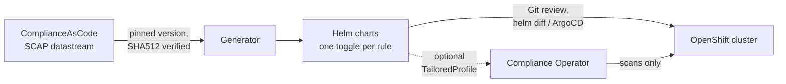

# openshift-compliance-remediations

[](https://github.com/slauger/openshift-compliance-remediations/actions/workflows/ci.yaml)
[](https://github.com/slauger/openshift-compliance-remediations/actions/workflows/release.yaml)
[](LICENSE)
[](https://github.com/slauger/openshift-compliance-remediations/blob/main/SECURITY.md)
[](https://docs.openshift.com/)

Generate Helm charts of OpenShift compliance **remediations** from the upstream [ComplianceAsCode/content](https://github.com/ComplianceAsCode/content) SCAP datastreams. This is the exact same content the OpenShift Compliance Operator materializes at runtime as `ComplianceRemediation` objects, extracted statically instead.

**New to this?** These charts harden your OpenShift cluster against established security benchmarks: CIS, BSI (German Federal Office for Information Security), DISA STIG, PCI-DSS, NIST 800-53 (moderate/high), NERC CIP and ACSC Essential Eight. You pick a profile, set it to `true` in `values.yaml`, and `helm install` applies the corresponding hardening: TLS policies, audit logging, encryption at rest, kubelet settings, OS-level controls and more, over 300 individually togglable rules. Every change is a plain Kubernetes manifest you can read, diff and version in Git *before* it touches the cluster; nothing is applied behind your back.

## Quick start

```bash
helm template compliance-platform oci://ghcr.io/slauger/charts/compliance-platform \
  --set profiles.ocp4-cis=true | oc apply --server-side --force-conflicts -f -
```

Applies all CIS platform remediations (safe, no reboots). Drop the pipe to preview, or diff it in ArgoCD.

Note it is `helm template | oc apply`, not `helm install`: these objects are **pre-existing cluster singletons** owned by cluster operators, which Helm refuses to adopt and must never delete. The node chart is the opposite - its objects are its own, so there `helm install` is the right command. [Install](#install) explains both, and why.

## Why

The Compliance Operator gives you two ways to apply remediations, and both have gaps:

- **Manual approval** (default): run a scan, wait for findings, then approve each `ComplianceRemediation` by hand. Reactive and slow; nothing is fixed until you've scanned and clicked through the results.
- **`autoApplyRemediations: true`**: the operator applies fixes automatically. Faster, but a **black box**. The actual manifests are materialized inside the cluster, so you can't review *what* changes before it happens, you have no Git history of your hardening posture, and a content update can silently alter applied objects.

Neither mode is the whole story, and neither is this project: for most rules upstream ships no Kubernetes remediation at all, so nothing can apply them - see [What a profile still leaves open](#what-a-profile-still-leaves-open). What follows is about the rules that *can* be applied.

Either way you don't own your hardening declaratively. This project extracts the very same remediations **statically** from the SCAP datastream into Helm charts, so instead you get:

- **Reviewable**: every fix is a plain manifest in Git; a `helm diff` / ArgoCD preview shows exactly what will change, per rule, before it hits the cluster.
- **Declarative & versioned**: your enabled profiles, per-rule overrides and variable values live in `values.yaml`; the applied posture is whatever Git says, full stop.
- **Explicit over implicit**: mutually-exclusive rules fail the render instead of silently merging; a content bump shows up as a concrete diff you approve, not a surprise re-apply.
- **Separation of duties**: the operator goes back to doing one thing well, **scanning**. Findings you decide to fix, you maintain in the chart (optionally re-scanned against a generated `TailoredProfile`).

## How it works


```mermaid
flowchart LR
    DS["ComplianceAsCode<br/>SCAP datastream"] -->|"pinned version,<br/>SHA512 verified"| GEN["Generator"]
    GEN --> CH["Helm charts<br/>one toggle per rule"]
    CH -->|"Git review,<br/>helm diff / ArgoCD"| OCP["OpenShift cluster"]
    CH -.->|"optional<br/>TailoredProfile"| CO["Compliance Operator"]
    CO -->|"scans only"| OCP
```

The generator downloads a pinned, checksum-verified content release, extracts every Kubernetes remediation, merges rules that target the same object, detects mutually-exclusive alternatives, and emits ready-to-install charts plus a full [rule matrix](RULES.md). A content update is a `config/content.yaml` bump whose effect shows up as a reviewable Git diff of the charts.

## Naming

Rules and profiles keep the **exact OpenShift/ComplianceAsCode naming** so results map 1:1:

- Profile: `<product>-<profile>`, e.g. `ocp4-cis`, `rhcos4-moderate`
- Rule id: `<product>-<rule_name_with_underscores>`, e.g. `ocp4-audit_profile_set`

## Labels

Object **names** are deliberately the operator-aligned ones, which means a chart-rendered
`MachineConfig` can share its name with one the Compliance Operator would create. Labels
are what tell the two apart. Every rendered object - remediations and `TailoredProfile`s
alike - carries the Kubernetes recommended set:

| Label | Value |
|---|---|
| `app.kubernetes.io/name` | the chart that rendered it: `compliance-node` or `compliance-platform` |
| `app.kubernetes.io/instance` | the Helm release name |
| `app.kubernetes.io/component` | `remediation` or `tailored-profile` |
| `app.kubernetes.io/part-of` | always `compliance-hardening` - this is the ownership selector |
| `app.kubernetes.io/managed-by` | `Helm` |

So, to see everything the charts own:

```bash
oc get machineconfig,kubeletconfig,tailoredprofile -A \
  -l app.kubernetes.io/part-of=compliance-hardening
```

`part-of` is a fixed literal, identical standalone and under the umbrella. `instance`
separates two releases of the same chart, which is exactly the
[mixed-architecture pattern](#applicability) (one release per architecture, each with its
own `node.roles`).

No label of ours sits under `compliance.openshift.io/` - that key space belongs to the
Compliance Operator. The one thing we do set there is the `product-type` **annotation**
on a `TailoredProfile`, because the operator requires it to route the scan.

Node objects additionally carry `machineconfiguration.openshift.io/role`, which is not
descriptive but functional: it is how the MCO associates the object with a pool.

## Charts

Two standalone charts plus a thin umbrella wrapper:

- `charts/compliance-platform/`: ocp4 platform config objects (APIServer, OAuth, IngressController, Project, Template, PrometheusRule). Safe, non-disruptive; no reboot.
- `charts/compliance-node/`: `MachineConfig` / `KubeletConfig` remediations (ocp4 node + all rhcos4). Gated behind `node.enabled=false` because applying them triggers **MachineConfigPool rollouts (node reboots)**. Emitted per node role.
- `charts/compliance-hardening/`: umbrella depending on both subcharts; values are prefixed per subchart (no `global`). Subcharts remain installable standalone.

### KubeletConfig

Kubelet remediations are consolidated the way the operator does it: **one `KubeletConfig` per MachineConfigPool**, named `compliance-operator-kubelet-<pool>`, that every active kubelet rule merges into - not one object per rule.

That is not cosmetic. A `KubeletConfig` without `spec.machineConfigPoolSelector` matches **no** pool (the MCO treats a nil selector as "nothing, not everything") so it would be created and then do nothing. The selector uses `pools.operator.machineconfiguration.openshift.io/<pool>: ""`, which the MCO puts on the built-in `master` and `worker` pools. **If you point `node.roles` at a custom pool, label that pool yourself** - the operator has the same requirement.

One difference we cannot mirror: if a pool already has its own `KubeletConfig`, the operator patches that object; a chart cannot inspect the cluster, so ours is an additional `KubeletConfig` for the pool. OpenShift supports several per pool, applying them in order.

## Conflicts and alternatives

Several rules target the **same** object (e.g. four rules edit `APIServer/cluster`). The generator merges disjoint contributions into one object, each rule individually togglable. Some rules are **mutually-exclusive alternatives**, e.g. two rules both write `spec.tlsSecurityProfile`. If more than one such rule is active, the chart **fails to render** with a clear message, forcing you to pick one. See [`RULES.md`](RULES.md) (rules marked ⚠️ alt).

## Rules whose upstream fix cannot work

Two of the three reproduce an upstream fix that writes `tlsSecurityProfile.Custom` with a capital C and no sibling `type:`. `Custom` is not a field, so the API server prunes it against the structural schema: the object applies cleanly, reports success, and changes nothing. Validated against the CRDs from `openshift/api` and independently with kubeconform:

```
at '/spec/tlsSecurityProfile': additional properties 'Custom' not allowed
```

They ship disabled, are marked stop/broken in [`RULES.md`](RULES.md), and enabling one now **aborts the render** rather than producing an object that quietly does nothing. Prefer the non-broken alternative in the same group.

A third rule, `rhcos4-audit_rules_time_stime`, costs far more than itself. Upstream writes both a 64-bit and a 32-bit audit rule for `stime`, but the syscall is not in the 64-bit table - `ausyscall stime` answers *"Unknown syscall stime using x86_64 lookup table"*. And `augenrules` stops at the first rule it cannot load. Measured on a live OKD 4.22 / CentOS Stream CoreOS 10 node with `rhcos4-moderate` applied:

```
$ systemctl is-failed audit-rules.service   -> failed
$ auditctl -l | wc -l                       -> 181      # of 223 rules in the file
$ auditctl -s | grep enabled                -> enabled 1 # the trailing -e 2 never ran
```

So one obsolete syscall silently dropped 42 audit rules - including the `delete` key that audits file removal - and left the audit configuration mutable, which the same profile separately requires. The node still looked hardened. `scripts/validate_payloads.py` now resolves every syscall an audit rule names through `ausyscall`, so this class cannot reach a cluster again.

## Rules that need an explicit opt-in

A few rules ship **disabled even when a profile selects them**, because the chart has no way to check the precondition first. They are marked **⚠️ opt-in** in [`RULES.md`](RULES.md), the reason sits next to the entry in `values.yaml`, and turning one on is a single line.

Currently five:

| Rule | Why |
| --- | --- |
| `ocp4-kubelet_enable_protect_kernel_defaults` | the kubelet refuses to start unless the kernel parameters it expects are already set |
| `rhcos4-service_sshd_disabled` | masks `sshd.service` and `sshd.socket`, removing the recovery path into a node |
| `rhcos4-coreos_nousb_kernel_argument` | boots with `nousb`; on bare metal that disables USB keyboards, so the console stops being a way back in |
| `rhcos4-coreos_page_poison_kernel_argument` | `page_poison=1` carries a measurable runtime cost |
| `ocp4-audit_error_alert_exists` | a stock cluster already ships this alert, and `cluster-kube-apiserver-operator` owns the field. See below |

The last one is a different case from the other four and worth spelling out, because it is the one place where this chart and the Compliance Operator genuinely diverge. **The operator remediates only what fails; a Helm chart applies everything selected.** On a live OKD 4.22 cluster the `AuditLogError` alert already existed, so the operator would report the rule compliant and never touch it. Applying upstream's fix anyway does two unwanted things: it drops the alert's `namespace` label (upstream's copy is older than what ships), and it takes `.spec.groups[apiserver-audit].rules` from an operator that actively reconciles it - server-side apply refuses the change outright, and client-side apply starts a fight the operator wins.

The first one deserves a word on ordering. `protectKernelDefaults: true` makes the kubelet refuse to start unless the kernel parameters it expects are already set - nodes go NotReady pool by pool as the rollout proceeds. The companion rule that sets those parameters (`ocp4-kubelet_enable_protect_kernel_sysctl`) is a MachineConfig and stays enabled, so the safe order is: let the sysctl remediation roll out, confirm the nodes are healthy, then enable this one.

The bar for this list is deliberately high - only rules whose failure mode is losing the node, or losing the access needed to fix it. A chart that quietly waters down the profile it claims to implement would be worse than one that reboots a node.

### Conflicts across objects

Upstream solves per-setting sshd configuration with drop-ins from OpenShift 4.13 - one small file per setting in `/etc/ssh/sshd_config.d/`, instead of rewriting the whole `sshd_config` as the pre-4.13 variants do. That is the right shape, and it creates a conflict the per-object check cannot see: the `enable` and `disable` variant of a setting are **separate rules writing the same drop-in**.

```
75-ocp4-sshd-disable-x11-forwarding   X11Forwarding no
75-ocp4-sshd-enable-x11-forwarding    X11Forwarding yes
```

Two MachineConfigs, one file. Nothing on the cluster rejects this - the MachineConfig Operator merges alphanumerically and the later one silently wins, which for three of the six affected settings is the *less* hardened value. So the chart refuses instead, the same way it does for alternatives inside one object. Both are marked ⚠️ alt in [`RULES.md`](RULES.md).

Below 4.13 the same applies to the whole-file variants, where `rhcos4-disable_host_auth` differs from the other 31 rules writing `sshd_config`. The guards carry the version window they belong to, so nothing fires where the fragments do not even render.

## Rule dependencies

Some rules must not be applied without another - upstream marks them `complianceascode.io/depends-on`, and the Compliance Operator refuses to apply a remediation whose dependency is unmet. The charts do the same: if a rule is active and a rule it requires is not, the render aborts and names both.

```
Error: 3 active rule(s) have an unmet dependency:
  rhcos4-usbguard_allow_hid_and_hub requires rhcos4-package_usbguard_installed, which is not active
  ...
```

This is **directional**. The dependency applied without the rule that needs it is fine and does not fail - only the other way round. The `requires` entries in [`RULES.md`](RULES.md) show which rules have one.

Every profile that selects a dependent rule also selects its dependency, so this only fires if you switch one off yourself through `rules:`. That is worth guarding: `ocp4-kubelet_enable_protect_kernel_defaults` needs `ocp4-kubelet_enable_protect_kernel_sysctl` to have set the kernel parameters first, and without them the kubelet refuses to start.

## Applicability

Upstream rules carry XCCDF `<platform>` constraints. The Compliance Operator evaluates them at scan time and reports a rule that does not apply as `notapplicable`, generating no remediation for it. The charts mirror that: rather than shipping a remediation the operator would never produce, they **refuse to render** and name every offending rule at once.

Two constraints depend on facts only you can supply, so they are values:

```yaml
cluster:
  architecture: x86_64        # of the pools listed in node.roles
  hypershift: false
```

`make show-node-arch` lists the distinct architectures of a live cluster's nodes. `amd64` and `arm64` are accepted and normalized to the spellings the compliance content uses, so either form works here.

For a non-default architecture the generator ships a ready-made overlay listing exactly the rules that architecture cannot use:

```sh
# standalone subchart
helm install compliance ./charts/compliance-node -f charts/compliance-node/values-aarch64.yaml

# umbrella - its own overlay, with the values nested per subchart
helm install compliance ./charts/compliance-hardening -f charts/compliance-hardening/values-aarch64.yaml
```

On aarch64 that is 21 rules (audit rules for syscalls ARM64 does not have), on s390x 5. Without the overlay the render aborts and tells you which rules and why.

**Mixed-architecture clusters**: `cluster.architecture` describes the pools named in `node.roles`, and MachineConfigs target pools. Install the node chart once per architecture with the matching `node.roles` and `cluster.architecture` - object names are role-suffixed, so the releases do not collide. Leaving the default on a mixed cluster keeps today's behaviour (the operator reports the ARM nodes' rules as `notapplicable`); setting `aarch64` would remove those rules from your x86 pools too.

Every other constraint is an assumption about RHCOS/OKD, documented per fact in [`applicability.py`](src/compliance_remediations_helm/applicability.py) with the reasoning. Three rules are never applicable at all and ship disabled. The **Applicability** column in [`RULES.md`](RULES.md) carries the constraint for every rule.

## What a profile still leaves open

Applying these charts does not make a profile pass. The largest reason has nothing to do with this project: **for most rules upstream ships no Kubernetes remediation at all.** Nothing can apply those - the Compliance Operator reports them `FAIL` (there is an OVAL check, fix it by hand) or `MANUAL` (only a questionnaire) and generates no remediation either. The scale is worth stating plainly:

| Profile | Selects | These charts apply | No remediation exists |
| --- | --- | --- | --- |
| `ocp4-cis` | 96 | 4 | 91 |
| `rhcos4-moderate` | 242 | 205 | 34 |

So `ocp4-cis` is mostly a to-do list for a human, while `rhcos4-moderate` is mostly automatable. [`RULES.md`](RULES.md#coverage-per-profile) carries the generated table for all profiles, plus the short list of rules that do have a remediation and still leave their control unmet.

Three residuals are worth naming here, because no generator can derive them. All three were measured on a live OCP 4.22.15 / RHCOS 9.8 cluster after applying `rhcos4-moderate`:

- **`rhcos4-enable_fips_mode`** - FIPS is an install-time decision. No MachineConfig can turn it on afterwards.
- **`rhcos4-sshd_limit_user_access`** - upstream ships **no remediation for it at all**, only an OVAL check and a questionnaire, so neither these charts nor the Compliance Operator can apply it. It is also the one of the three you can close yourself: see [Adding your own objects](#adding-your-own-objects).
- **`rhcos4-service_usbguard_enabled`** - the remediation is inert as a day-2 change, and not because of this chart. Upstream writes a `systemd.units` entry with `enabled: true` and **no `contents`**, which Ignition applies at provisioning time; the MachineConfig Operator does not act on it during an update. On the cluster the package arrived (`extensions: [usbguard]` worked, `rpm -q usbguard` -> `usbguard-1.1.4-2.el9`) and the three sibling rules pass, but the unit stayed `disabled / inactive` and the MCO journal never mentions it:

```
$ journalctl | grep usbguard
machine-config-daemon: "Applying extensions : [\"update\" \"--install\" \"usbguard\"]"
$ systemctl is-enabled usbguard   -> disabled
```

  Two rules in the charts use that shape; the other, `rhcos4-service_auditd_enabled`, passes only because RHCOS enables `auditd` anyway. The operator's own remediation is byte-identical, so it has the same limitation.

### Checking it on your own cluster

Point the Compliance Operator at the same profile and compare - the operator scans, the chart applies:

```bash
oc apply -f - <<'YAML'
apiVersion: compliance.openshift.io/v1alpha1
kind: ScanSettingBinding
metadata:
  name: verify
  namespace: openshift-compliance
profiles:
  - {apiGroup: compliance.openshift.io/v1alpha1, kind: Profile, name: rhcos4-moderate}
settingsRef:
  apiGroup: compliance.openshift.io/v1alpha1
  kind: ScanSetting
  name: default
YAML
oc get compliancecheckresult -n openshift-compliance
```

Keep `autoApplyRemediations` off. The operator's remediations target the same object names as the charts on purpose - one `KubeletConfig` per pool, named `compliance-operator-kubelet-<pool>` - and letting both manage one object means an un-apply can delete what the chart owns.

For reference, measured on OCP 4.22.15 / RHCOS 9.8 with Compliance Operator v1.10.0, applying `ocp4-cis` + `ocp4-cis-node` + `rhcos4-moderate` to both pools: the evaluable checks went from **49.0% to 97.0%** (194 to 385 passing), 190 checks flipped `FAIL` to `PASS`, and **nothing regressed**. On OKD/SCOS the rhcos4 profiles are a different story: the whole profile reports `NOT-APPLICABLE`, because its CPE tests for `enterprise_linux_coreos` and CentOS Stream CoreOS does not match. The hardening still applies and works there - verified on the node - but a scan will not confirm it for you.

### Adding your own objects

Some controls have no upstream remediation but are still one manifest away. `extraManifests` renders objects you supply, with the chart's labels, so your own additions get the same review-before-apply treatment as everything else:

```yaml
extraManifests:
  sshd-allow-users:
    apiVersion: machineconfiguration.openshift.io/v1
    kind: MachineConfig
    metadata:
      name: 75-local-sshd-allow-users
      labels:
        machineconfiguration.openshift.io/role: worker
    spec:
      config:
        ignition:
          version: 3.1.0
        storage:
          files:
            - path: /etc/ssh/sshd_config.d/50-allow-users.conf
              mode: 384
              overwrite: true
              contents:
                source: "data:,AllowUsers%20core%0A"
```

That example closes `rhcos4-sshd_limit_user_access`. Its OVAL check is an `OR` over `AllowUsers`, `AllowGroups`, `DenyUsers` and `DenyGroups`, so **one** of them is enough - no need for `AllowGroups` as well - and the file pattern it matches accepts drop-ins:

```
filepath: ^(/etc/ssh/sshd_config|/etc/ssh/sshd_config\.d/.*\.conf)$
pattern:  (?i)^[ ]*AllowUsers[ ]+((?:[^ \n]+[ ]*)+)$
```

`AllowUsers core` is also close to a no-op on who can actually log in, which is what makes it safe: on a stock RHCOS node `core` is the only account with an authorized key, and `PermitRootLogin no` already comes from `40-rhcos-defaults.conf`. It states the effective answer rather than changing it, and stops a later user added through `passwd.users` from silently gaining SSH. Keep `core` in the list - it is the recovery path into a node.

**Toggling works like `rules`.** Each entry takes an optional `enabled` (default true), and because `extraManifests` is a map rather than a list, an overlay can switch one entry off without restating the others - Helm merges maps and *replaces* lists:

```yaml
# values-staging.yaml
extraManifests:
  sshd-allow-users:
    enabled: false
```

Or `--set extraManifests.sshd-allow-users.enabled=false`.

These objects are **not** upstream content and are not in [`RULES.md`](RULES.md): everything in `templates/` other than this comes from the pinned ComplianceAsCode release, and the generator deliberately does not author hardening of its own. They carry `app.kubernetes.io/component: local` so a cluster query tells the two apart, and unlike the chart's own node objects they are rendered verbatim - set the pool role label yourself, and emit one entry per pool if you need both.

## Install

Released charts are published as signed OCI artifacts under `ghcr.io/slauger/charts/`. Charts are cosign keyless-signed and ship an SBOM attestation. See [`SECURITY.md`](SECURITY.md) for how to verify a signature before installing.

The two charts install **differently**, and the reason is ownership: the node chart creates objects that are ours, while every platform object but one already exists on a stock cluster and belongs to a cluster operator.

### compliance-node: `helm install`

```bash
helm install compliance-node oci://ghcr.io/slauger/charts/compliance-node \
  --namespace openshift-compliance --create-namespace \
  -f my-values.yaml
```

Every `MachineConfig` and `KubeletConfig` is new, so Helm owns them cleanly. `helm uninstall` deletes them, which is what you want: the pools roll back to the configuration they had before.

### compliance-platform: render and server-side apply

```bash
helm template compliance-platform oci://ghcr.io/slauger/charts/compliance-platform \
  -f my-values.yaml | oc apply --server-side --force-conflicts -f -
```

Not `helm install`. Checked against a live OKD 4.22 cluster, five of the six objects already existed and each was owned by a cluster operator:

| Object | Field manager | Exists on a stock cluster |
|---|---|---|
| `APIServer/cluster` | `cluster-version-operator` | yes |
| `OAuth/cluster` | `cluster-version-operator` | yes |
| `Project/cluster` | `cluster-version-operator` | yes |
| `IngressController/default` | `ingress-operator` | yes |
| `PrometheusRule/audit-errors` | `cluster-kube-apiserver-operator` | yes |
| `Template/co-project-request` | - | no, this one is ours |

Three consequences, in order of how much trouble they save you:

1. **`helm install` refuses**, with `invalid ownership metadata ... missing key "app.kubernetes.io/managed-by"`. That is the right default and nothing is touched.
2. **`--take-ownership` is not enough.** It lifts only Helm's own release-ownership check. Underneath, Helm 4 applies server-side, and the API server still refuses fields another manager owns - Helm exposes no `--force-conflicts`.
3. **Plain client-side `oc apply -f` appears to work and should not be used.** It has no field-manager conflict detection, so it silently takes fields away from the operator that owns them.

`--force-conflicts` takes over exactly one field today, `.spec.audit.profile`, from the cluster-version-operator. That is safe and is the supported way to configure audit logging: `APIServer/cluster` carries `release.openshift.io/create-only: "true"`, so the CVO creates the object and never reconciles it. Run the apply without `--force-conflicts` first and read the conflicts - a conflict against an *actively reconciled* object means a fight you lose, not a field to take.

**Removing platform hardening is not `helm uninstall`.** These objects carry `helm.sh/resource-policy: keep`, so a Helm-managed release will never delete them - deleting `IngressController/default` would take the router down, and deleting `Project/cluster` while its `Template/co-project-request` survives would break project creation. To undo, edit the objects back.

## Generating from source

```bash
make venv         # create venv + install the generator
make generate     # download + verify datastreams, regenerate charts + RULES.md
make verify       # full pipeline: generate, docs, lint, unit tests
```

Finer-grained targets (`docs`, `lint`, `test`, `test-py`, `show-ocp-version`) are in the `Makefile`.

Configure via a values override (standalone platform chart shown):

```yaml
cluster:
  ocpVersion: "4.20"          # selects version-dependent remediations
  architecture: x86_64        # x86_64 | aarch64 | ppc64le | s390x
  hypershift: false           # true on a HyperShift hosted cluster
profiles:
  ocp4-cis: true              # whitelist whole profiles
  ocp4-bsi: true
rules:
  ocp4-audit_profile_set: false   # blacklist / override individual rules
  ocp4-api_server_encryption_provider_cipher: true   # or enable a single rule with no profile
tailoredProfile:
  enabled: false              # set true to also render a matching TailoredProfile
complianceNamespace: openshift-compliance
```

Node chart adds:

```yaml
node:
  enabled: false              # opt in to node reboots
  roles:                      # MachineConfigPool roles; combined master+worker nodes
    - worker                  # (SNO/OKD) land in the master pool, so include master
    - master
```

## Time synchronisation

Five chrony rules ship the **whole** `/etc/chrony.conf`, not just their own setting, and upstream makes them byte-identical - so they are consolidated into one MachineConfig (`75-ocp4-chrony`) instead of five writing the same three files. Enabling any one of them still renders the full configuration.

The default NTP servers are the public pool, which plenty of clusters cannot reach. Since these rules overwrite chrony's configuration wholesale, **check this before enabling any of them** - a node that cannot sync time will eventually break etcd and certificate validation. Point them at your own servers with the existing variables:

```yaml
variables:
  var_multiple_time_servers: "ntp1.intern.example.com,ntp2.intern.example.com"
  var_time_service_set_maxpoll: "10"
```

Through the umbrella the same keys carry the subchart prefix, e.g. `compliance-node.variables.var_multiple_time_servers`.

which renders:

```
server ntp1.intern.example.com minpoll 4 maxpoll 10
server ntp2.intern.example.com minpoll 4 maxpoll 10
```

## Tunable variables

XCCDF variables (e.g. TLS versions, token lifetimes, kubelet eviction thresholds) are exposed under `variables:` in `values.yaml`, pre-filled with the value most compliance profiles refine them to. This default is **global**, not per active profile: if you enable a single profile whose intended value differs from the cross-profile majority, adjust the variable explicitly. The rendered `TailoredProfile` `setValues` use the same global values, so keep the two in sync when you override.

## Updating content

Bump `config/content.yaml` (`version` + `sha512`), run `make generate`, review the Git diff. It shows exactly which rules/fixes changed between content releases.

## License

Apache-2.0. Extracted content originates from ComplianceAsCode/content (Apache-2.0).
